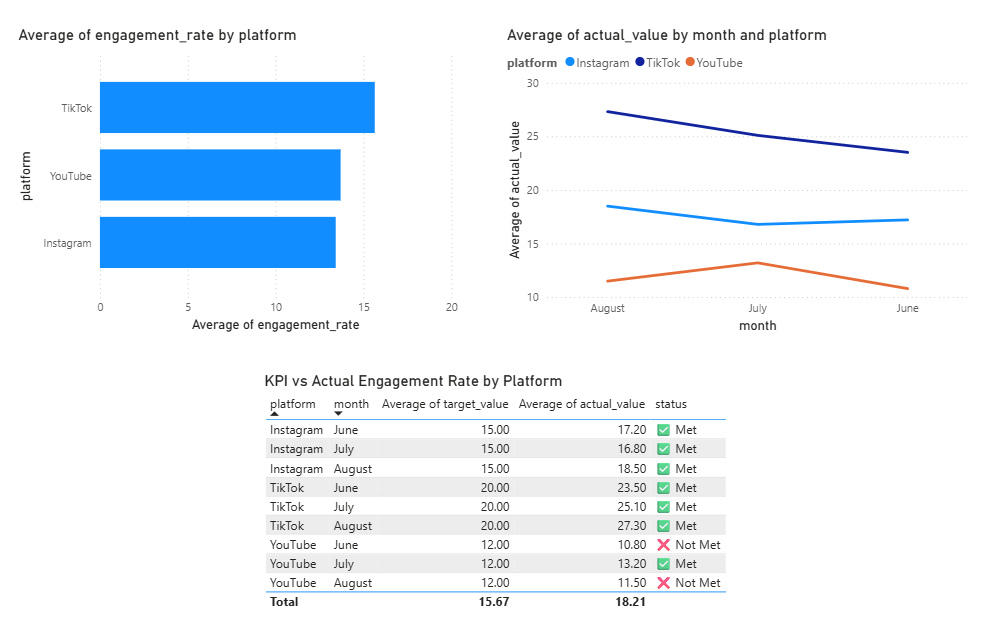

# Social Media Content Performance Analytics

**By Armanee Mardstool | Data Analytics Portfolio Project**

---

## Project Overview

This project analyzes social media content performance data across Instagram, TikTok, and YouTube for an educational content company. The analysis is based on real experience as a Marketing Content Intern, where content was planned, produced, and published across multiple platforms with weekly KPI tracking.

---

## Business Problem

> *"The company invests heavily in content production across multiple platforms, but lacks clarity on which platform and content type delivers the best return relative to KPIs."*

**Key pain points identified:**
1. No centralized system to compare performance across platforms
2. KPI tracking was done manually with no visual dashboard
3. Content type effectiveness was never formally measured
4. No trend analysis to identify which months performed best

---

## Objectives

- Compare Engagement Rate across Instagram, TikTok, and YouTube
- Identify which Content Type (Video, Reels, Carousel) performs best
- Track KPI achievement by platform and month
- Provide actionable content strategy recommendations

---

## Dataset

Simulated dataset built from real Marketing Content Intern experience, structured across 3 tables:

| Table | Description | Rows |
|---|---|---|
| Content | Post details (date, platform, content type, topic) | 25 |
| Performance | Engagement metrics (reach, likes, comments, shares, saves, engagement rate) | 25 |
| KPI_Target | Monthly KPI targets vs actual values by platform | 9 |

**Data source:** Simulated based on personal experience as Marketing Content Intern at Baanvichakorn Company Limited (June – August 2023)

---

## Analysis

### SQL Queries

**1. Engagement Rate by Platform**
```sql
SELECT 
    c.platform,
    COUNT(*) AS total_posts,
    ROUND(AVG(p.reach), 0) AS avg_reach,
    ROUND(AVG(p.engagement_rate), 2) AS avg_engagement_rate
FROM Content c
JOIN Performance p ON c.content_id = p.content_id
GROUP BY c.platform
ORDER BY avg_engagement_rate DESC;
```

**2. Best Performing Content Type**
```sql
SELECT 
    c.content_type,
    COUNT(*) AS total_posts,
    ROUND(AVG(p.reach), 0) AS avg_reach,
    ROUND(AVG(p.likes), 0) AS avg_likes,
    ROUND(AVG(p.engagement_rate), 2) AS avg_engagement_rate
FROM Content c
JOIN Performance p ON c.content_id = p.content_id
GROUP BY c.content_type
ORDER BY avg_engagement_rate DESC;
```

**3. KPI Achievement by Platform and Month**
```sql
SELECT 
    platform,
    month,
    target_value,
    actual_value,
    ROUND(actual_value - target_value, 2) AS difference,
    CASE 
        WHEN actual_value >= target_value THEN 'Met'
        ELSE 'Not Met'
    END AS kpi_status
FROM KPI_Target
ORDER BY platform, month;
```

---

## Key Findings

| Finding | Result |
|---|---|
| Highest Engagement Rate Platform | TikTok — 15.64% |
| Lowest Engagement Rate Platform | Instagram — 13.42% |
| Best Content Type | Video — 14.73% |
| Worst Content Type | Carousel — 12.64% |
| Platform meeting KPI every month | Instagram & TikTok |
| Platform failing KPI | YouTube (June & August) |
| TikTok Engagement Rate Growth | June 23.5 → August 27.3 (+3.8) |

---

## What Didn't Work

- Attempted to find correlation between topic category and engagement — insufficient data variation to draw meaningful conclusions
- Tried to analyze day-of-week posting patterns — dataset did not have enough granularity to show significant differences

---

## Business Recommendations

1. **Increase TikTok Investment** — TikTok consistently outperforms other platforms and shows a growing trend. Allocate more content budget here.
2. **Prioritize Video Content** — Video delivers the highest Engagement Rate and Reach across all platforms. Reduce Carousel production.
3. **Review YouTube Strategy** — YouTube failed KPI in 2 out of 3 months. Consider changing content format or posting frequency.
4. **Standardize KPI Dashboard** — Replace manual Excel tracking with a Power BI dashboard for real-time performance monitoring.

---

## Tools Used

| Tool | Purpose |
|---|---|
| Google Sheets | Dataset creation and data cleaning |
| DB Browser for SQLite | SQL analysis and querying |
| Power BI Desktop | Dashboard and data visualization |

---

## Dashboard Preview



**Dashboard includes:**
- Average Engagement Rate by Platform (Bar Chart)
- Engagement Rate Trend by Month (Line Chart)
- KPI vs Actual Engagement Rate by Platform (Table)

---

## About This Project

This project was built as part of my Data Analytics portfolio to demonstrate end-to-end analytical skills — from data collection and SQL querying to dashboard creation and business recommendation.

The business context is drawn from my real experience as a Marketing Content Intern at Baanvichakorn Company Limited in Bangkok, Thailand, giving this analysis practical grounding beyond a typical academic exercise.

**Connect with me on LinkedIn:** [Armanee Mardstool](https://linkedin.com/in/armanee-mardstool)
